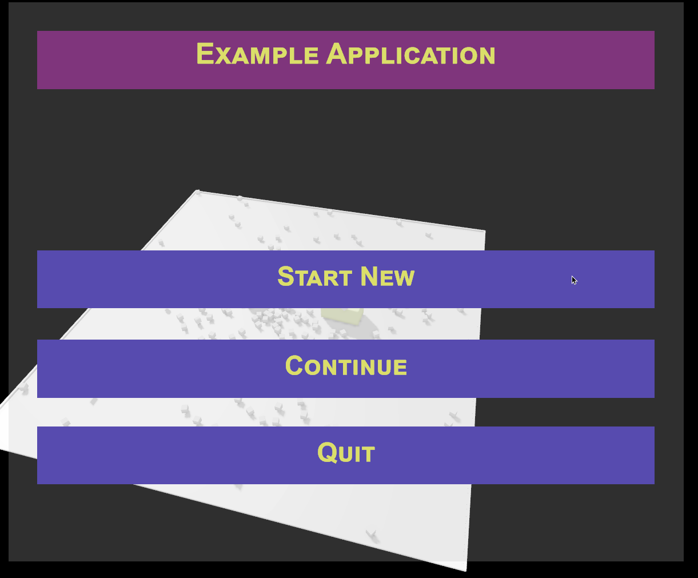
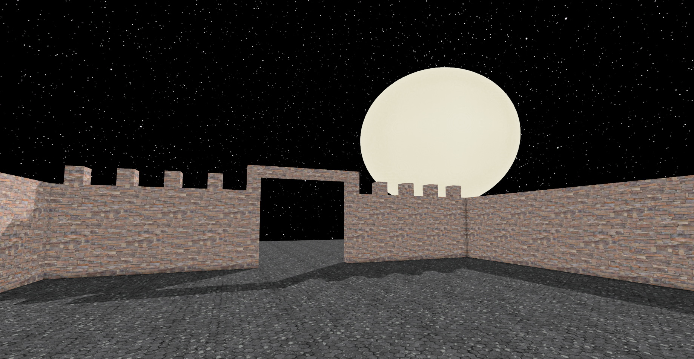
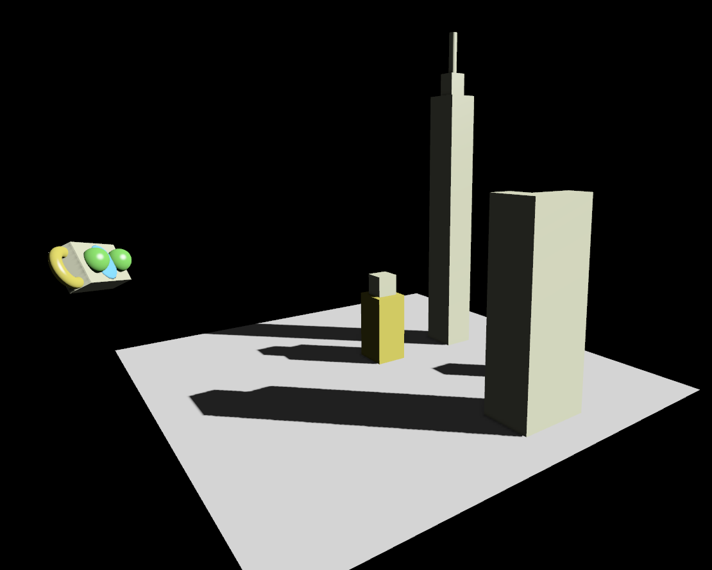

# C4-Engine examples
This repository is a collection of basic examples for C4Engine (https://c4engine.com/). If you are interested in a specific version, use the particular [tag](https://github.com/nasosi/C4EngineExamples/tags).

<div align="center">
<p float="center">
  
   
  
</p>
</div>

This repository uses ```git lfs```, and to clone, you may need to use the following sequence of commands:
```bash
git lfs install # This will install git lfs for your user account. It needs to be executed only once per account.
git clone
cd C4EngineExamples
git lfs pull
```
## Why a CMake template
Besides CMake being the build tool I am most familiar with, some additional reasons motivated developing a CMake-based toolchain. These are (a) Enabling code sharing in a way that makes compilation and execution of user applications an easy task; This is currently not easy with C4-Engine because one needs to respect the engine license, and the process of introducing additional apps involves many manual steps (b) Automate several build tasks, (c) Enable easier team-working by disengaging certain parts of the Engine, and (d) CMake appears to become the defacto C++ build tool: it is supported by most IDEs, and is very popular within the C++ user community.

The  C4-Engine CMake template offers several features that ease the development of applications, particularly for developers used to working with CMake. The template:
1. Provides a platform for sharing and team working on a  C4-Engine project yet honoring the sweat of the  C4-Engine developers by allowing easy compliance with the C4Engine license requirements.
2. Offers non-intrusive access to the C4Engine source code.
3. Provides automatic import of resources that have been modified, like textures and string files.
4. Enables projects to enclose their source code and resources fully; no folders are shared between the Engine, Tools, and user projects.
5. Enables easy setup of new applications. Configuring multiple files manually is unnecessary; just clone the project-specific files. 
6. Allows multiple projects to share the same C4Engine source code and C4Engine resources.
7. Offers automatic installer generation based on NSIS ( Nullsoft Scriptable Install System), or bundle into a zip archive. The installer is compatible with C4-Engine pack files.

## How to compile the examples and use the CMake template
1. Decide if you want to make the C4 Engine code a part of your project. 
    * If you plan to share your application source code publicly or with entities that do not hold a C4 license, then you are probably not allowed to make the C4-Engine code and resources part of it; or If you do not plan to modify the C4 Engine code, then you can place the Engine Code and Data at any accessible location and possibly share it amongst your projects.
    * If you plan to modify the C4 code as part of your project, then it is advisable to copy the Engine Code and Data to a location in your source directory. It allows source versioning control and makes it easy for IDEs to detect the source files. Your project folder structure will then look like this:
```
            |v MyGame
              |> cmake
              |v C4Engine <- Place the C4 Engine code and data here
                |> Data
                |> EngineCode
                ...
              |> src
              | CMakeLists.txt
              | Readme.md
              | ...
 ```
 2. Set the C4CodeRoot and C4DataRoot in your IDE or through the CMake command to point to the C4 root folder. The contents of the two folders (code and data) can be merged; in this case, both variables can be set to something like `C:\users\john\source\MyGame\C4Engine`.   
 3. Run CMake to generate the project
 4. Compile
 5. Run
 
## User selectable options
There are several selectable options, although using the defaults is usually preferable. The `C4CodeRoot` and `C4DataRoot` are not optional and should point to the C4Engine main folder(s).

| Name                       |   Default    | Description                                                                                                                                                                                                                                                                                                      |
|----------------------------|:------------:|------------------------------------------------------------------------------------------------------------------------------------------------------------------------------------------------------------------------------------------------------------------------------------------------------------------|
| `C4CodeRoot`               |     Empty    | C4Engine engine code path. Usually placed in a common location for access by multiple projects. Alternatively, the contents can be placed in a project subfolder, and the source code modified if desired. If Empty errors out.                                                                                  |
| `C4DataRoot`               |     Empty    | C4Engine engine data path. It is usually placed in a common location for access by multiple projects. Alternatively, the contents can be placed in a project subfolder, and the resources modified if desired. If Empty errors out.                                                                              |
| `C4ActiveApp`              |     Empty    | C4Engine active application. This will define which .dll the C4Engine.exe will load upon execution. If Empty, the first application included is activated. If you wish to change the current app, change this variable in your CMake configuration such that appropriate files are copied, symlinked, and imported.|
| `C4ForceCopyEngineImport`  |    `false`   | Copy the Engine Import directory instead of creating a symlink.                                                                                                                                                                                                                                                  |
| `C4ForceCopyToolsData`     |    `false`   | Copy the Tools Data directory instead of creating a symlink.                                                                                                                                                                                                                                                     |
| `C4ForceCopyToolsImport`   |    `false`   | Copy the Tools Import directory instead of creating a symlink.                                                                                                                                                                                                                                                   |
| `C4BuildThe31st`           |    `false`   | Optionally build the game "The 31st"                                                                                                                                                                                                                                                                             |
| `C4ForceCopyThe31stData`   |    `false`   | Copy the Te31st data directory instead of creating a symlink.                                                                                                                                                                                                                                                    |
| `C4ForceCopyThe31stImport` |    `false`   | Copy the Te31st import directory instead of creating a symlink.                                                                                                                                                                                                                                                  |
| `C4InfiniteShadowResolution`  |      `0`     | If other than `0`, overrides the default shadow map size (1024).                                                                                                                                                                                                                                                 |
| `C4EnableBuildTimeImport`  |    `true`    | Modify C4 Engine source code to enable importing resources during build time.                                                                                                                                                                                                                                    |
| `C4InstallPlugins`         |    `false`   | Install C4 Plugins alongside applications and data.                                                                                                                                                                                                                                                              |
| `C4PackUponInstall`        |    `true`    | Pack the data upon cmake install. Affects the contents of the installer or bundled app.                                                                                                                                                                                                                          | 
| `C4UseNSIS`                |    `false`   | Use NSIS to create an installer. If `false`, use zip to create a bundled app.                                                                                                                                                                                                                                       |

In Visual Studio, the items above can be changed by accessing the `Configuration` drop-down menu and selecting `Manage Configurations`. Then after making the desired change and saving the .json file, CMake will be reconfigured.

# List of examples
The currently available examples are shown in the table below.

| Name                       |    Description                                                                                                                                                                                                                                                                                                      |
|----------------------------|------------------------------------------------------------------------------------------------------------------------------------------------------------------------|
| 001_simple                 |    A basic example that contains a very simple world. Demonstrates basic concepts, such as finding a spectator marker, placing the camera, and setting up basic input  |
| 002_text_display           |    Demonstrates how to display some static text on the screen. |
| 003_start_window           |    A basic menu using C4Engine's panels. The user can click to start the game. |
| 004_improved_start_window  |    An improved menu where the user can start, resume or quit the game. |
| 005_physics_and_collision  |    A world with basic physics and collision. |
| 006_simple_shader          |    A simple procedural shader. |
| 007_simple_animated_shader |    An animated procedural shader. |
| 008_adding_geometry_with_collision_programmatically | Demonstration on how to programmatically add geometry with collision. |
| 009_custom_controller | A custom controller used to rotate geometry that has collision enabled. |
| 010_node_iterator | A node iterator that can be used in c++ range-based loops. |
| 011_user_controlled_object | A tiny space city with a user-controlled spacecraft. |
| 012_texture | Texturing example and automated asset import using CMake targets. |
| 013_terrain | In progress....|

## Changing the current application
To change the active application, modify the `C4ActiveApp` variable and reconfigure CMake. CMake will update the game.cfg file and other directories and files that may need to be changed. 

# Version format
C4EngineExamples version follows the following pattern: v[C4-Engine version].[C4EngineExamples version for the particular C4-Engine version]. For example for C4-Engine version 7.1.1, and for C4EngineExamples version 2, the version will be: v7.1.1.2
