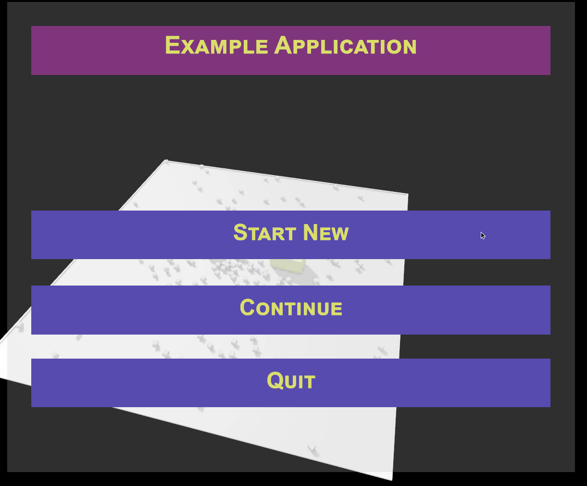
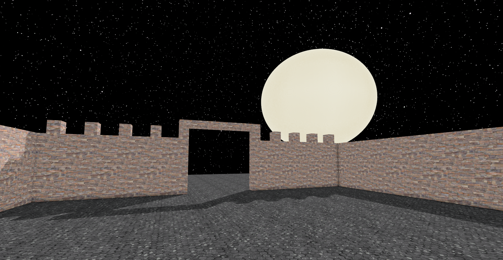
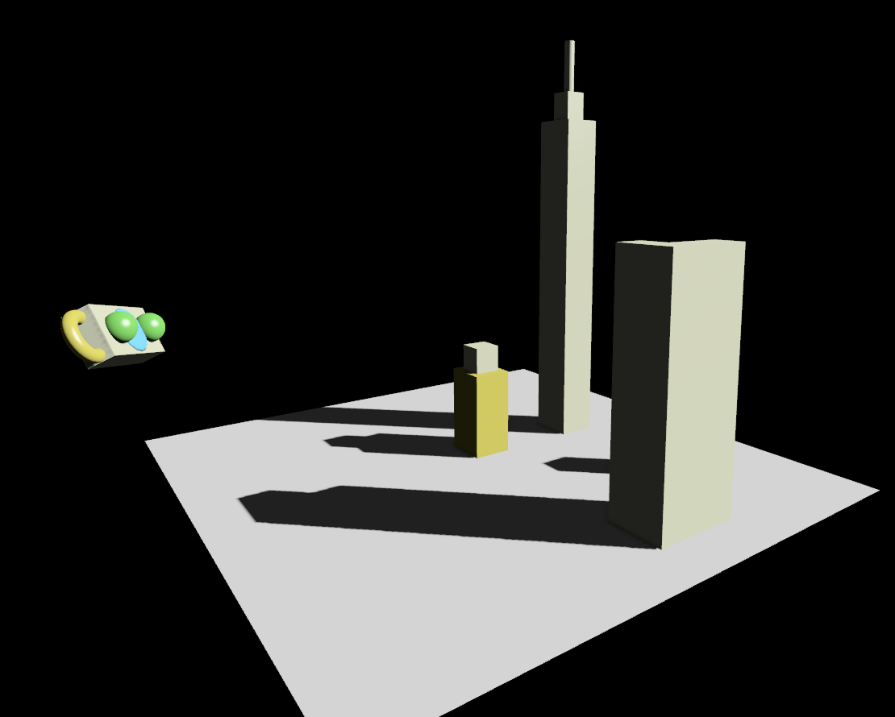

# C4-Engine examples
This repository is a collection of basic examples for C4Engine (https://c4engine.com/).

<div align="center">
<p float="center">
  
   
  
</p>
</div>

# C4 Engine – Adding Examples to the C4 Engine Solution

To add the examples to the C4 Engine solution, follow the steps below.

### 1. Folder Setup
Place the **Examples** folder inside a subdirectory named **V4** within the main **C4** folder. The structure should look like:
```
C4-Engine
└── Data
└── EngineCode
...
└── V4
     └── Examples
           └── 001_Simple
           └── 002_Display_Text
```
Alternatively, and instead of manually setting up the folder structure, you can add them as a git submodule with the following git commands:
  1. ```git submodule add https://github.com/nasosi/C4EngineExamples V4```
  2. ```git submodule update --init --recursive```


### 2. Open the Solution
Open the C4 Visual Studio Solution from:
```{C4 Engine Root Folder}\VisualStudio-Win\C4\C4.sln```
### 3. Create a Solution Folder
In **Solution Explorer** (usually top-left in Visual Studio):

- Right-click the solution (e.g., *Solution "C4"*)
- Select **Add → New Solution Folder**
- Name it: ```Examples```
---
### 4. Add the First Example Project
- Right-click the newly created **Examples** folder
- Select **Add → Existing Project**
- Navigate to: ```{C4 Engine Root Folder}\V4\Examples\001_Simple```
---
- Select the `.vcxproj` file and click **Open**

---

### 5. Add Remaining Examples
Repeat the same process for each remaining example project:

- Right-click **Examples**
- Choose **Add → Existing Project**
- Select the `.vcxproj` file for each example folder

### 6. Create Data and Import junctions
Execute the CreateJunctions.bat file from the C4Engine\V4\Examples subfolder.

# List of examples
The currently available examples are shown in the table below.

| Name                       |    Description                                                                                                                                                                                                                                                                                                      |
|----------------------------|------------------------------------------------------------------------------------------------------------------------------------------------------------------------|
| 001_Simple                 |    A basic example that contains a very simple world. Demonstrates basic concepts, such as finding a spectator marker, placing the camera, and setting up basic input  |
| 002_Text_Display           |    Demonstrates how to display some static text on the screen. |
| 003_Start_Window           |    A basic menu using C4Engine's panels. The user can click to start the game. |
| 004_Improved_Start_Window  |    An improved menu where the user can start, resume or quit the game. |
| 005_Physics_and_Collision  |    A world with basic physics and collision. |
| 006_Simple_shader          |    A simple procedural shader. |
| 007_Simple_Animated_Shader |    An animated procedural shader. |
| 008_Adding_Geometry_with_Collision_Programmatically | Demonstration on how to programmatically add geometry with collision. |
| 009_Custom_Controller | A custom controller used to rotate geometry that has collision enabled. |
| 010_User_Controlled_Object | A tiny space city with a user-controlled spacecraft. |
| 011_texture | Texturing example and automated asset import using CMake targets. |

# Version format
C4EngineExamples version follows the following pattern: v[C4-Engine version].[C4EngineExamples version for the particular C4-Engine version]. For example for C4-Engine version 7.1.1, and for C4EngineExamples version 2, the version will be: v7.1.1.2
